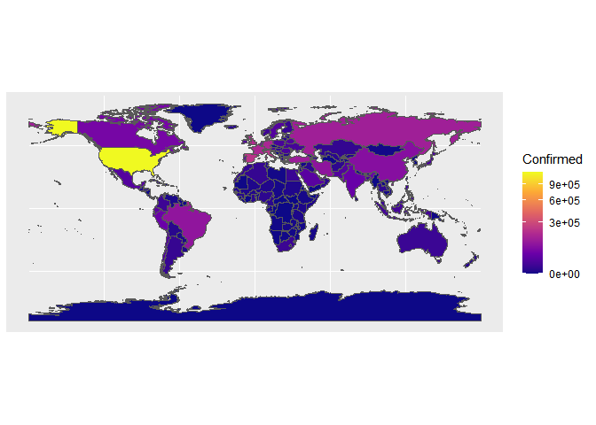
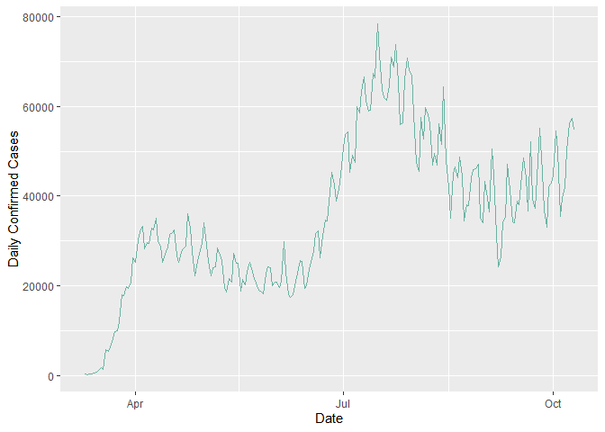

<!-- README.md is generated from README.Rmd. Please edit that file -->


# CovidPlot19

<!-- badges: start -->

[](https://travis-ci.com/alibalapour/CovidPlot19)
[](https://travis-ci.com/alibalapour/CovidPlot19)
<!-- badges: end -->

This repo is an R package implemented to get covid19 data from Jhon Hopkins university’s [CSSEGISandData repository](https://github.com/CSSEGISandData/COVID-19) and draw some plots about the covid-19 pandemic. 

## Installation

And the development version from [GitHub](https://github.com/) with:

``` r
# install.packages("devtools")
devtools::install_github("alibalapour/CovidAtion19")
```

## Example

This is a basic example:

``` r
df <- suppressWarnings(suppressMessages(CovidAtion19::getData()))
```

``` r
head(df, 20)
#> # A tibble: 20 x 6
#> # Groups:   Country [2]
#>    Country       Date       Confirmed Deaths DailyConfirmed DailyDeaths
#>    <chr>         <date>         <dbl>  <dbl>          <dbl>       <dbl>
#>  1 " Azerbaijan" 2020-02-28         1      0              0           0
#>  2 "Afghanistan" 2020-02-24         1      0              0           0
#>  3 "Afghanistan" 2020-02-25         1      0              0           0
#>  4 "Afghanistan" 2020-02-26         1      0              0           0
#>  5 "Afghanistan" 2020-02-27         1      0              0           0
#>  6 "Afghanistan" 2020-02-28         1      0              0           0
#>  7 "Afghanistan" 2020-02-29         1      0              0           0
#>  8 "Afghanistan" 2020-03-01         1      0              0           0
#>  9 "Afghanistan" 2020-03-02         1      0              0           0
#> 10 "Afghanistan" 2020-03-03         1      0              0           0
#> 11 "Afghanistan" 2020-03-04         1      0              0           0
#> 12 "Afghanistan" 2020-03-05         1      0              0           0
#> 13 "Afghanistan" 2020-03-06         1      0              0           0
#> 14 "Afghanistan" 2020-03-07         1      0              0           0
#> 15 "Afghanistan" 2020-03-08         4      0              3           0
#> 16 "Afghanistan" 2020-03-09         4      0              0           0
#> 17 "Afghanistan" 2020-03-10         5      0              1           0
#> 18 "Afghanistan" 2020-03-11         7      0              2           0
#> 19 "Afghanistan" 2020-03-12         7      0              0           0
#> 20 "Afghanistan" 2020-03-13         7      0              0           0
```

``` r
CovidAtion19::plotOnWorldMap(date = '2020-05-03',
                             type = 'Confirmed')
```



``` r
CovidAtion19::plotTimeSeries(startDate = '2020-03-10',
                             endDate = '2020-10-10',
                             country = 'US',
                             type = 'DailyConfirmed')
```


