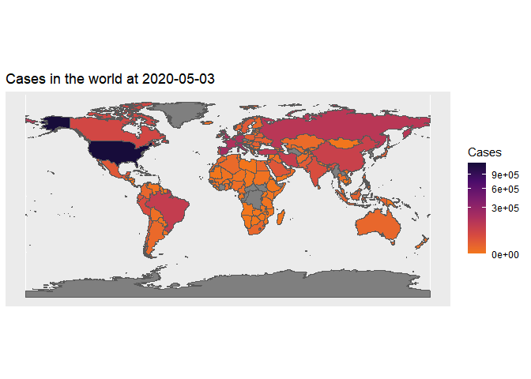

<!-- README.md is generated from README.Rmd. Please edit that file -->


# CovidPlot19

<!-- badges: start -->
<!-- badges: end -->

This repo is an R package implemented to get covid19 data from Jhon
Hopkins university’s CSSEGISandData repository and draw some plots about
the covid-19 pandemic.

## Installation

You can install the development version from
[GitHub](https://github.com/alibalapour/CovidPlot19) with:

``` r
options(warn=-1)
# install.packages("devtools")
devtools::install_github("alibalapour/CovidPlot19")
#> Skipping install of 'CovidPlot19' from a github remote, the SHA1 (c9ec7fd3) has not changed since last install.
#>   Use `force = TRUE` to force installation
```

## Example

This is a basic example which shows you how to solve a common problem:

``` r
df <- suppressWarnings(suppressMessages(CovidPlot19::getData()))
head(df, 20)
#> # A tibble: 20 x 6
#> # Groups:   Country [2]
#>    Country       Date       Cases Deaths DailyCases DailyDeaths
#>    <chr>         <date>     <dbl>  <dbl>      <dbl>       <dbl>
#>  1 " Azerbaijan" 2020-02-28     1      0          0           0
#>  2 "Afghanistan" 2020-02-24     1      0          0           0
#>  3 "Afghanistan" 2020-02-25     1      0          0           0
#>  4 "Afghanistan" 2020-02-26     1      0          0           0
#>  5 "Afghanistan" 2020-02-27     1      0          0           0
#>  6 "Afghanistan" 2020-02-28     1      0          0           0
#>  7 "Afghanistan" 2020-02-29     1      0          0           0
#>  8 "Afghanistan" 2020-03-01     1      0          0           0
#>  9 "Afghanistan" 2020-03-02     1      0          0           0
#> 10 "Afghanistan" 2020-03-03     2      0          1           0
#> 11 "Afghanistan" 2020-03-04     4      0          2           0
#> 12 "Afghanistan" 2020-03-05     4      0          0           0
#> 13 "Afghanistan" 2020-03-06     4      0          0           0
#> 14 "Afghanistan" 2020-03-07     4      0          0           0
#> 15 "Afghanistan" 2020-03-08     5      0          1           0
#> 16 "Afghanistan" 2020-03-09     7      0          2           0
#> 17 "Afghanistan" 2020-03-10     8      0          1           0
#> 18 "Afghanistan" 2020-03-11    11      0          3           0
#> 19 "Afghanistan" 2020-03-12    12      0          1           0
#> 20 "Afghanistan" 2020-03-13    13      0          1           0
```

``` r
CovidPlot19::plotOnWorldMap(date = '2020-05-03', type = 'Cases')
```



``` r
CovidPlot19::plotTimeSeries(startDate = '2020-06-10',
               endDate = '2021-07-10',
               country = 'Germany',
               type = 'Cases',
               static = T
               )
```


